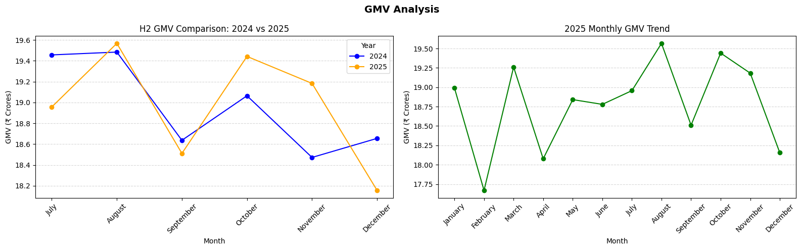
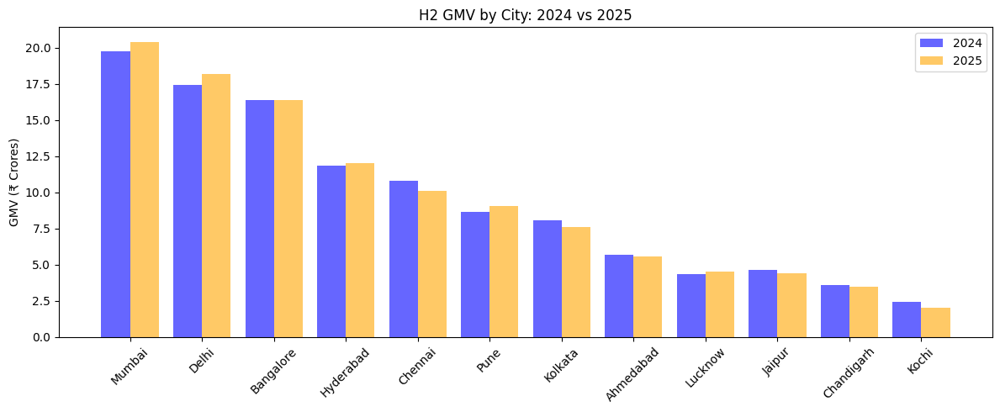
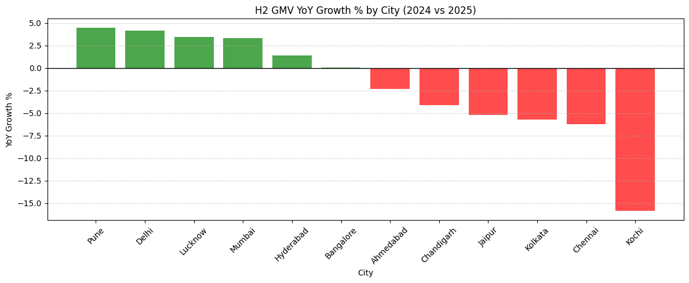
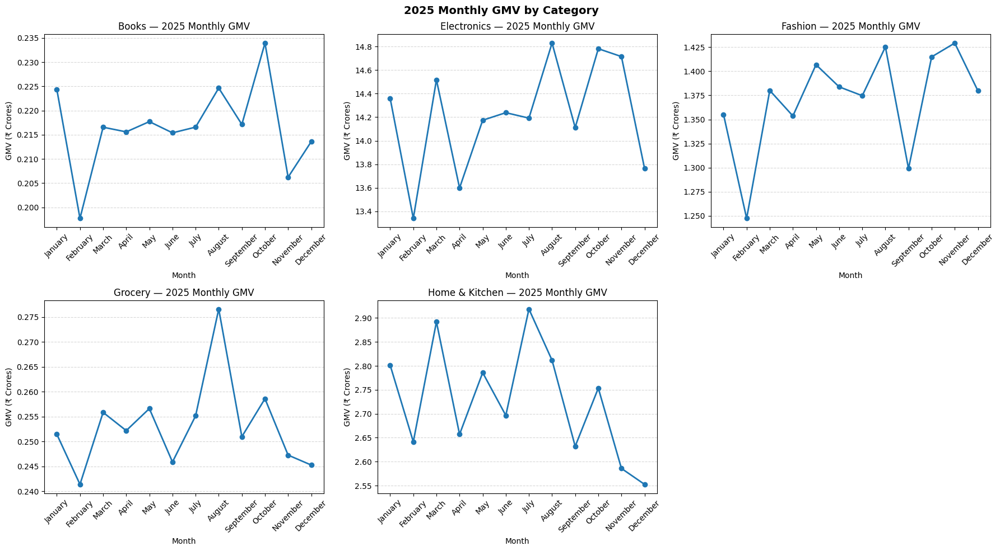
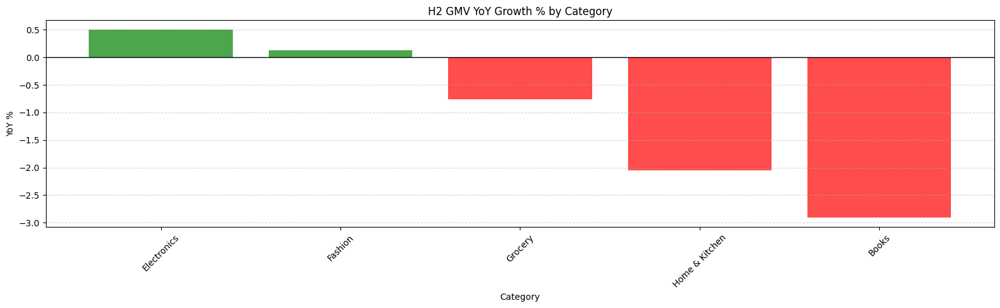
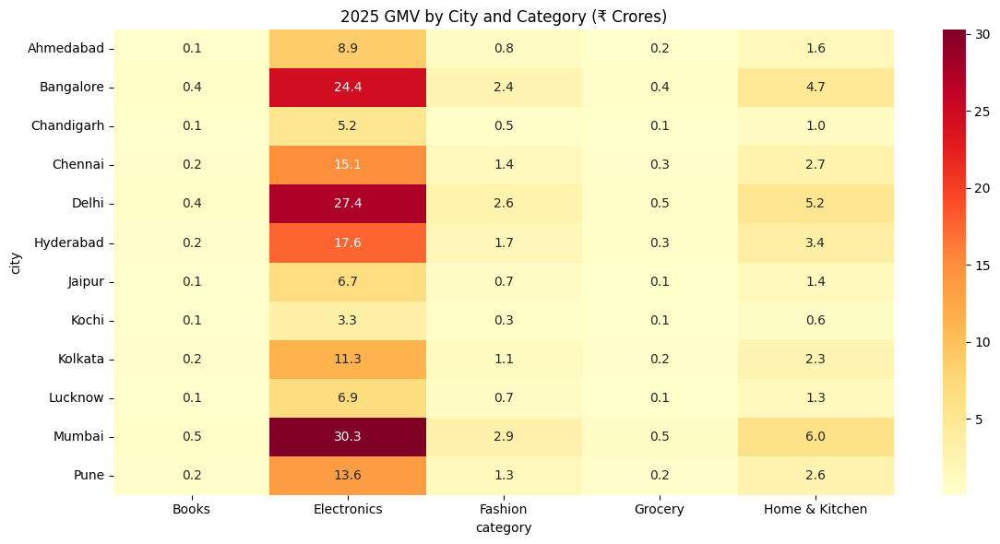
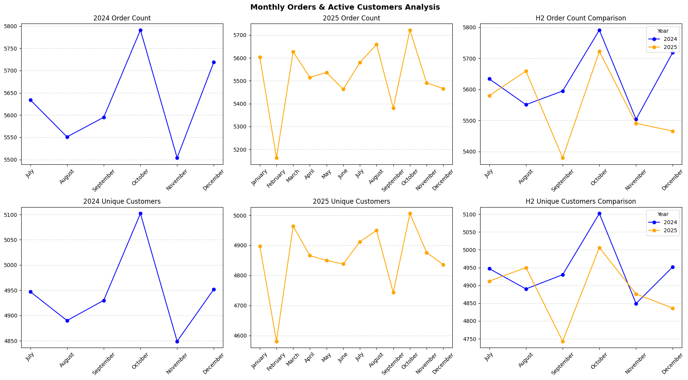
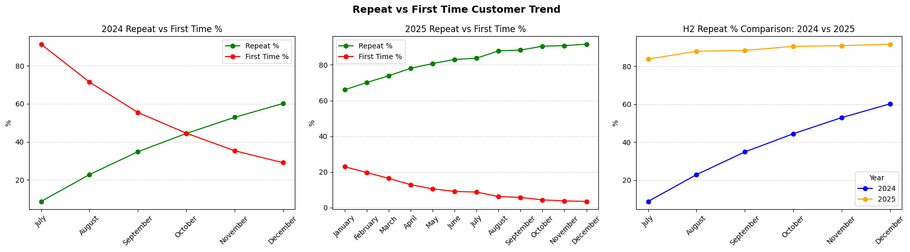
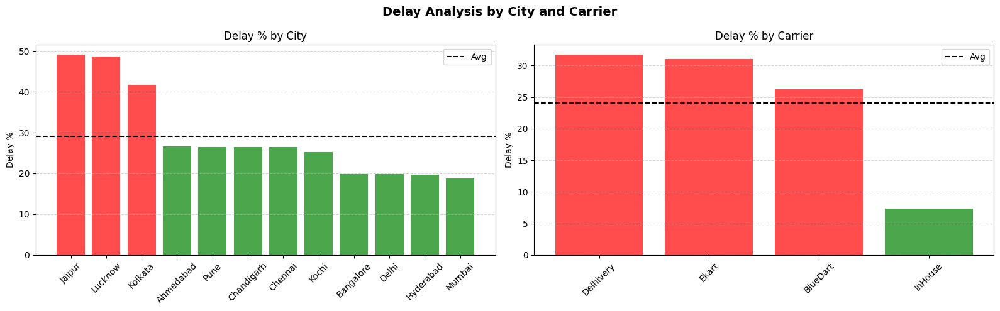

*QuickKart Analytics Assessment*

## How to Run
pip install -r requirements.txt
streamlit run src/app.py

## Project Structure
Ojcommerce_Task/
├── src/
│   ├── app.py
│   └── calculations.py
├── Notebooks/
├── Data/
├── Plots/
├── sql/queries.sql
└── README.md

## Key Assumptions
- Repeat customer = ≥2 delivered orders
- Delayed = any Late_1_2d, Late_3_5d, Late_5p or Lost status
- GMV = quantity × unit_price before platform fee
- H2 comparison used for YoY (Jul-Dec common window)
- Shipped orders treated as in-transit, not lost

## AI Usage
- Used Claude for boilerplate streamlit code
- All SQL queries written and verified manually
- All business interpretations are my own
- Verified all calculations against raw data

# Monthly GMV by city and category
1. H2 YoY (2024 vs 2025):
        GMV is mostly flat with mixed signals — November showed the strongest growth (+3.85%, +₹71 Lakhs) but July and December both declined ~2.57-2.68%, suggesting no consistent growth momentum in H2 2025.

   2025 Full Year:
        Monthly GMV is remarkably stable between 7.84% - 8.68% with February being the weakest (₹17.67 Crores) and August the strongest (₹19.57 Crores) — a difference of only ₹1.9 Crores across 12 months indicating a plateaued business with no seasonal GMV spike even during festive October.

2. GMV by City :

    Top 3→ Mumbai + Delhi + Bangalore = ₹162 Crores (47% of total GMV)
    Bottom 3 → Lucknow + Chandigarh + Kochi = ₹31 Crores (9% of total GMV)

    H2 GMV by City: 2024 vs 2025
    Growing Cities :
        Pune      → +4.45%  
        Delhi     → +4.17%  
        Lucknow   → +3.45%  
        Mumbai    → +3.30%

    Declining Cities :
        Chennai   → -6.22%
        Kolkata   → -5.69%
        Kochi     → -15.87% ← most alarming

     
    

    GMV growth is a tale of two halves — North Indian cities (Delhi, Pune, Lucknow) growing while South Indian cities (Chennai, Kolkata, Kochi) declining

3. Category GMV Analysis
   H2 YoY Growth:
        Electronics  → +0.50%   stable
        Fashion      → +0.13%   barely growing
        Grocery      → -0.76%   declining
        Home&Kitchen → -2.05%   alerming 
        Books        → -2.91%   alerming

    Home & Kitchen and Books are declining 
      Both shrinking YoY (-2.05% and -2.91%) — small categories getting even smaller

    No category shows strong growth
    Highest growth is Electronics at just +0.50% — entire catalogue is stagnant
    February is weakest month across all categories
     
     

4. city vs category:

   Every city tells the same story — 80% Electronics, 10% Home & Kitchen, 10% everything else — QuickKart has zero category diversification across all markets which is a single point of failure for GMV.
   

# Monthly count of orders and unique active customers.

    Average orders per month    → ~5,500
    Average customers per month → ~4,900
    Gap → ~600 orders

    Repeat Customers:

    Using only 2025 full year data, repeat purchase rate grew from 66.01% (Jan 2025) → 91.60% (Dec 2025) — a 25 percentage point jump in 12 months showing strong retention. However with only 167 new customers in December 2025 (3.45%), the platform is running almost entirely on its existing base with negligible new acquisition.

    Unique Active Customers:

    Monthly unique customers are flat between 4,581 - 5,006 throughout 2025 with no meaningful growth — the same ~4,800 customers ordering every month across 12 cities signals a customer acquisition problem that needs immediate attention before the repeat base naturally churns out. 

# Share of delayed orders by city and carrier.

Stop using Delhivery for Jaipur and Lucknow — 82% delay rate on these lanes is indefensible and is the single biggest fixable cause of QuickKart's declining on-time delivery rate.

Jaipur  + Delhivery → 82.36% delayed 
Lucknow + Delhivery → 82.01% delayed
Kolkata + Ekart     → 77.41% delayed

10 Key Findings for QuickKart Leadership

1. Yes — On-Time Delivery IS Declining and It's Seasonal

OnTime deliveries crash every Oct-Nov without fail — from ~3,800 to ~2,470 (▼35%) both in 2024 and 2025 during the highest GMV festive period. This is predictable, recurring and unaddressed.

2. Delhivery is the Biggest Carrier Problem

Handles the most volume (29,539 shipments) but worst ontime rate (62.81%) — meaning 1 in 3 Delhivery shipments is late. Avg delivery time of 42.43hrs means it's constantly on the edge of breaking the 48hr promise.

3. QuickKart is Paying More for Worse Service

BlueDart costs ₹108/shipment with only 68.41% ontime vs InHouse at ₹62/shipment with 86.82% ontime. Spending 74% more for 18% worse performance — a clear case for shifting volume to InHouse.

4. Jaipur and Lucknow are Delivery Black Holes

These two cities appear repeatedly as worst destinations:

Chennai→Jaipur  : 52.71% late
Kolkata→Lucknow : 51.16% late
Delhi→Jaipur    : 50.97% late

Last mile delivery into Jaipur and Lucknow is structurally broken.

5. InHouse Delivery is the Underutilized Solution

InHouse delivers in 22hrs on average (under 1 day!), costs the least (₹62) and has the best ontime rate (86.82%) — yet third party carriers handle the majority of volume. Scaling InHouse is the single biggest logistics lever available.

6. GMV is at Risk — ₹339 Crores Processed but 13% Lost Monthly

With ₹339 Crores total GMV and ~13% of orders cancelled or returned every month (~8% cancellation + ~5% return), QuickKart is silently losing ~₹44 Crores in potential GMV every year to incomplete orders.

7. Platform is Moving Downmarket — Premium Customers Declining

Premium segment shrinking (-0.65% in H1 2024) while Budget (+2.47%) and Value (+3.29%) grow. Since Premium customers spend more per order, this directly threatens GMV per order and take-rate long term.

8. Chennai and Kochi Have the Worst Seller Quality

1 in 3 sellers in Chennai is poorly rated (31.25% poor sellers). Kochi has highest poor seller % with lowest best seller % — poor seller quality in these cities likely directly contributes to delivery delays and returns.

9. Retention is Excellent but New Customer Acquisition is Dying

Repeat rate grew from 78% (Jan 2025) to 96% (Dec 2025) — impressive retention. But only 177 new customers in December 2025 (3.24% of orders). With no new customers entering the funnel, GMV growth has no foundation.

10. Order Volume is Flat — Platform Has Hit a Growth Ceiling

H2 orders declined -1.47% (2024 vs 2025). Monthly orders stuck between 5,163-5,722 with no growth trend. Combined with declining new acquisitions and recurring festive delivery failures — QuickKart risks a steeper decline in 2026 if delivery performance and acquisition are not addressed immediately.

Bottom Line for Leadership:

QuickKart has a loyal customer base and healthy GMV but is held back by three fixable problems — seasonal delivery collapse, overreliance on underperforming carriers, and zero new customer acquisition. Fix these three and the platform can meaningfully grow in 2026.